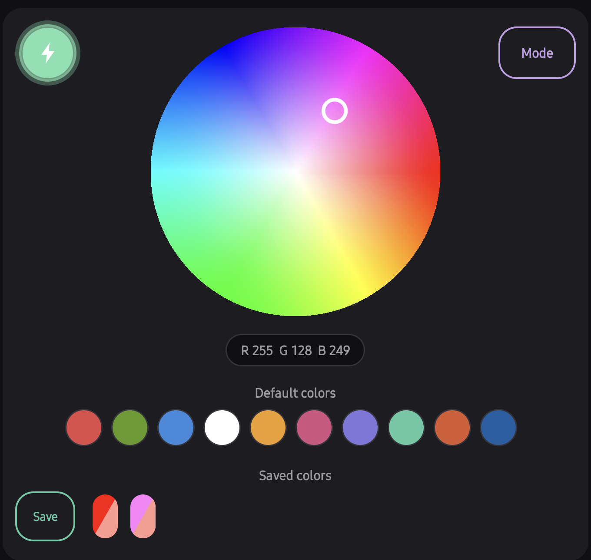
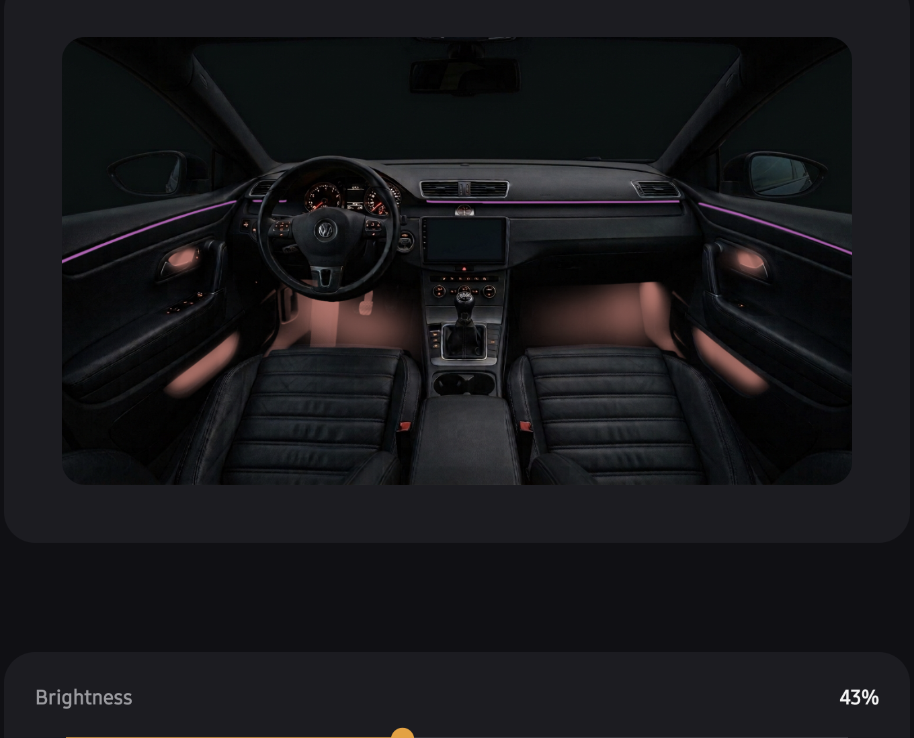
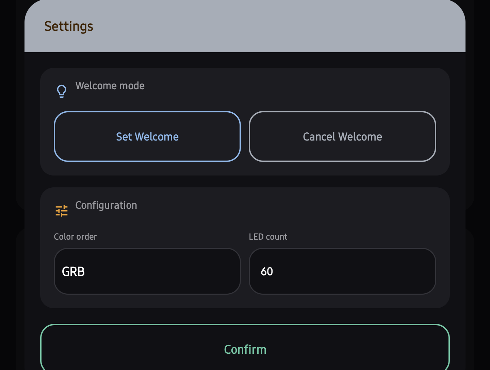
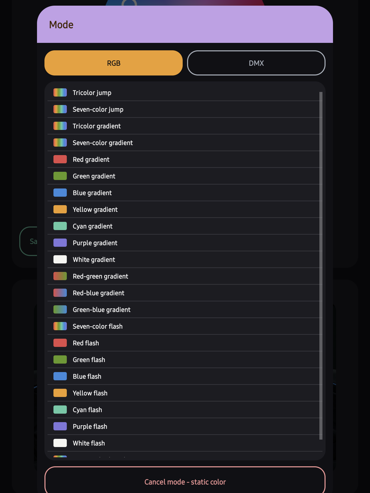
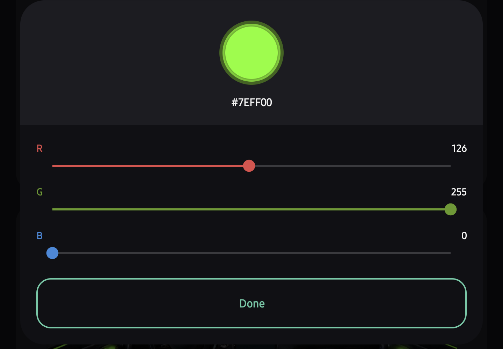

# LEDCAR-01 VW CC

Reverse-engineered BLE protocol, a custom Android controller, and a BLE
peripheral simulator for **LEDCAR-01** interior ambient LED strip kits (the
generic "car ambient light" DMX/RGB strips sold for VW CC and similar
interiors) — built because the official app is clunky, ad-laden, and doesn't
support independent RGB + DMX zone control.

<p align="center">
  
  
</p>

<p align="center">
  
  
  
</p>

## What's in this repo

| Path | What it is |
|---|---|
| [`LedCar01Controller/`](LedCar01Controller) | The Android app (Java) — the actual daily-driver controller |
| [`LedCar01Simulator/`](LedCar01Simulator) | A Windows BLE GATT peripheral simulator (C# + optional Python GUI) used to reverse-engineer and regression-test the protocol without the real strip powered on |
| [`PROTOCOL.md`](PROTOCOL.md) | Standalone deep-dive protocol reference (byte-level frame tables, how each finding was verified) |

## App features

- **Two independently-controlled zones** — the "RGB" and "DMX" tabs each keep
  their own live color, brightness, and last-used effect; switching tabs
  never clobbers the other zone's state.
- **HSV color wheel** with a long-press popup for exact R/G/B entry.
- **200+ built-in effects** — 23 "RGB tab" presets plus 210 "DMX zone"
  presets (jumps, gradients, flashes, breathing, etc.), each with speed
  control and a "static color" cancel button to drop back out of effect mode.
- **Saved color "eggs"** — each saved swatch stores *both* zones' colors
  together in one slot; tap either half to recall just that zone, long-press
  to delete.
- **Live ambient interior preview** — a photo of the actual dashboard with
  independently-tintable overlay layers (dash neon strip, footwell/door-handle/storage
  glow) that recolor in real time as you pick colors — the strip follows the
  DMX zone, the footwell/handle glow follows the RGB zone, and both scale
  with each zone's own brightness (screenshot above).

- **Connection-aware UI** — every control that would send a BLE command is
  disabled while disconnected or powered off, so there's no way to fire a
  command into the void; auto-reconnect brings it back automatically.
- **In-app update checker** — checks GitHub Releases on this repo for a
  newer build and offers a one-tap download + install (see
  [Updating](#updating) below).

## Building

Requirements: Android Studio (or a JDK 17+ / Android SDK command-line
toolchain), `compileSdk 34`, `minSdk 26`.

```bash
cd LedCar01Controller
./gradlew assembleDebug      # debug build
./gradlew assembleRelease    # release build (app/build/outputs/apk/release/)
```

Open the `LedCar01Controller/` folder directly in Android Studio to run/debug
on a device — the strip advertises as `LEDCAR-01-...` over BLE, so a real
unit (or [LedCar01Simulator](LedCar01Simulator), see below) is needed to test
against.

### Running the simulator

`LedCar01Simulator` hosts a real BLE GATT peripheral on a Windows PC,
renamed to `LEDCAR-01-SIM01` so the app's (and the original vendor app's)
name-prefix filter accepts it, and logs every decoded frame it receives —
this is how the protocol below was reverse-engineered and confirmed against
real vendor-app traffic.

```bash
cd LedCar01Simulator
dotnet run
```

or double-click `run.bat`. `gui.py` is an optional Tk front-end over the same
simulator for driving it without the app.

## Updating

The app checks `https://api.github.com/repos/FuzzBC/ledcar_vw_cc/releases/latest`
on launch. If the release's tag encodes a newer `versionCode` than the
installed build, it offers an in-app download + install — no Play Store
involved. See [`UpdateChecker.java`](LedCar01Controller/app/src/main/java/com/ledcar01/controller/UpdateChecker.java)
for the exact comparison logic.

**Publishing a release** (maintainers): bump `version.properties`, build
`assembleRelease`, then run `publish_release.ps1` (needs a GitHub token in a
local, gitignored `github_release.properties` — copy
`github_release.properties.example` and fill it in). The script tags the
release `V<versionMajor>.<versionCode>`, uploads the APK as a release asset,
and pulls the release notes straight out of `CHANGELOG.md`.

---

# BLE protocol reference

Reverse engineered from the decompiled vendor app
(`com.home.net.NetConnectBle`) and confirmed against real vendor-app traffic
captured by [LedCar01Simulator](LedCar01Simulator).

## Transport

| | |
|---|---|
| GATT service | `0000ffe0-0000-1000-8000-00805f9b34fb` |
| GATT characteristic (write + notify) | `0000ffe1-0000-1000-8000-00805f9b34fb` |
| Device name prefix | `LEDCAR-01-` |
| Frame size | 9 bytes, fixed |
| Header byte | `0x7B` |
| Trailer byte | `0xBF` |

Every command is `HEADER, b1, b2, b3, b4, b5, b6, b7, TRAILER`. Unused byte
positions are filled with `0xFF`.

## Commands

Builders live in
[`Car01Protocol.java`](LedCar01Controller/app/src/main/java/com/ledcar01/controller/Car01Protocol.java);
the simulator's decoder is in
[`Program.cs`](LedCar01Simulator/Program.cs).

| Command | Frame | Builder method | Status |
|---|---|---|---|
| Power on/off | see "Power paths" below | `Car01Protocol.powerOn()` / `powerOff()` | ✅ confirmed live, DMX-zone variant used by the app |
| Set color | see "Three color paths" below | `Car01Protocol.setColor(r,g,b)` | ✅ confirmed live, all 3 variants observed |
| Set brightness | see "Brightness paths" below | `Car01Protocol.setBrightness(percent)` | ✅ confirmed live, all zone variants observed |
| Set mode | see "Mode paths" below | `Car01Protocol.setMode(id)` | ✅ confirmed live (RGB-tab path; app now fixed to match) |
| Set speed | see "Mode paths" below | `Car01Protocol.setSpeed(percent)` | ✅ confirmed live (DMX-zone path only so far) |
| Set direction | `7B FF 0D <dir> FF FF FF FF BF` — `dir`: 0=forward, 1=reverse | `Car01Protocol.setDirection(dir)` | ⚠️ implemented, not yet tested live |
| Music/mic mode | `7B FF 0B <on> 01 FF FF FF BF` | `Car01Protocol.setMusicMode(on)` | ⚠️ implemented, not yet tested live |

## Three color paths

The vendor app's top-level selector reads **RGB \| LED \| DMX** (confirmed
from a screenshot of the real app) and each of the three sends a genuinely
different frame — confirmed live by triggering each one individually:

| Tab | Frame | Meaning | Source method |
|---|---|---|---|
| "RGB" tab (plain) | `7E FF 05 03 R G B FF EF` | sets one flat color, no zone concept | `setBleRgb(r,g,b)` |
| "DMX" tab | `7B 00 07 R G B <dir> FF BF` | color applies per-zone/segment (individually addressable) | `setCar01Rgb(r,g,b, mode=0, dir)` |
| "LED" tab | `7B 01 07 R G B <dir> FF BF` | color applies uniformly to all zones (sync) | `setCar01Rgb(r,g,b, mode=1, dir)` |

The only difference between the DMX and LED frames is the single `mode` byte
right after the header (`00` vs `01`) — everything else is identical. The
"RGB" tab uses an entirely different opcode family (`0x7E` header, opcode
`05 03`) shared with the older LEDBLE-style devices, not the CAR01-specific
`0x7B` opcode `07`.

## Brightness paths

Mirrors the color-path split: a plain RGB-tab command plus a CAR01 command
whose flag byte (index 5) selects the target zone.

| Tab | Frame | Source method |
|---|---|---|
| "RGB" tab (plain) | `7E FF 01 <percent> 00 FF FF FF EF` | `setBrightness()`, plain-RGB branch |
| "DMX" tab | `7B FF 01 <scaled> <percent> 00 FF FF BF` — flag `00` | `setBrightness()`, CAR01 branch, zone flag 0 |
| "LED" tab | `7B FF 01 <scaled> <percent> 02 FF FF BF` — flag `02` | `setBrightness()`, CAR01 branch, zone flag 2 |

`scaled = percent * 32 / 100`. The zone flag byte also has a `01` value
reserved for "music-reactive" per the decompiled source, not yet observed
live.

## Power paths

Same RGB/LED/DMX split again, and it's not just a flag byte this time — the
DMX and LED variants have completely different on/off byte values, which
caused a real decoding bug (`0x06`/`0x07` were both mislabeled "power off"
until this was found and fixed):

| Tab | Power on | Power off | Source |
|---|---|---|---|
| "RGB" tab | `7E FF 04 01 FF FF FF FF EF` | `7E FF 04 00 FF FF FF FF EF` | `carturnOn/Off()`, neither DMX nor sync flag set |
| "DMX" tab | `7B FF 04 01 FF FF FF FF BF` | `7B FF 04 00 FF FF FF FF BF` | `carturnOn/Off()`, DMX flag set |
| "LED" tab | `7B FF 04 07 FF FF FF FF BF` | `7B FF 04 06 FF FF FF FF BF` | `carturnOn/Off()`, sync flag set |

The app currently uses the "DMX" tab variant (`01`/`00`) for its single
power button — this is a real, valid command (not a bug), just worth noting
it doesn't match the "LED tab (sync)" semantics the app's color/brightness
commands use. Functionally it powers the whole strip either way.

## Mode paths

Mode and speed follow the **same tab split as color and brightness** — plain
RGB tab vs. DMX zone tab — except each tab uses a completely different id
space, not just a flag byte. This was found by triggering the first and last
entries on each tab and matching the ids against two different decompiled
resource arrays:

| Tab | Frame | Id range | Source method / resource |
|---|---|---|---|
| "RGB Color" tab | `7E FF 03 <id> 03 FF FF FF EF` | 135–157 (23 effects) | `setRgbMode()` → `car_mode` array, see table below |
| "DMX zone" tab | `7B FF 03 <id> FF FF FF FF BF` | 1–210, plus `255`=Auto | `setRgbMode()` (DMX branch) → `dmx_model` array (211 entries, all extracted into `DmxModeNames` in [`Program.cs`](LedCar01Simulator/Program.cs)) |

Speed mirrors this split too:

| Tab | Frame | Source method |
|---|---|---|
| "RGB Color" tab | `7E FF 02 <percent> 00 FF FF FF EF` | `setSpeed()`, plain-RGB branch |
| "DMX zone" tab | `7B FF 02 <percent> FF 00 FF FF BF` | `setSpeed()`, CAR01/DMX branch |

**This caught a real bug**: `Car01Protocol.setMode()` in the Android app was
sending `car_mode` ids (135–157, the RGB-tab range) over the `0x7B`
DMX-zone-tab header — a combination the real device never actually produces,
since real hardware always pairs the RGB-tab id range with the `0x7E` header.
Fixed to send `7E FF 03 <id> 03 FF FF FF EF` instead, matching real traffic.

## Preset modes (opcode `0x03`, id 135–157)

| Name | id | Name | id |
|---|---|---|---|
| Tricolor jump | 135 | Yellow flash | 153 |
| Seven-color jump | 136 | Cyan flash | 154 |
| Tricolor gradient | 137 | Purple flash | 155 |
| Seven-color gradient | 138 | White flash | 156 |
| Red gradient | 139 | Seven-color breath | 157 |
| Green gradient | 140 | Seven-color flash | 149 |
| Blue gradient | 141 | Red flash | 150 |
| Yellow gradient | 142 | Green flash | 151 |
| Cyan gradient | 143 | Blue flash | 152 |
| Purple gradient | 144 | | |
| White gradient | 145 | | |
| Red-green gradient | 146 | | |
| Red-blue gradient | 147 | | |
| Green-blue gradient | 148 | | |

The DMX zone tab's 211-entry preset list (ids 1–210, plus `255` = Auto) is
long enough to live only in code — see `DmxModeNames` in
[`Program.cs`](LedCar01Simulator/Program.cs).

## Connection handshake

The vendor app sends this automatically the instant it connects, before any
user action — a fixed default password/auth frame. It does **not** need a
response; color/brightness/power commands worked fine afterward without the
simulator replying to it, confirming these modules don't actually enforce it.

| Command | Frame | Source method |
|---|---|---|
| Password/auth handshake | `2A 02 A1 23 45 67 C1 <nonce> AF` | `setPassword()` |

## Discovered but not implemented in the app

Seen live from the vendor app while briefly touching a config/pixel-count
screen — not needed for the app's current feature set, documented here for
reference:

| Command | Frame | Source method |
|---|---|---|
| SPI config | `7B FF 05 04 <b> <pixelCount> <colorOrder> FF BF` | `setConfigSPI()` — confirmed live: `pixelCount=132, colorOrder=3 (GRB)` matched a real "132 pixels, GRB" config screen. `colorOrder` values come from the `rgb_sort_ble` resource table: `1=RGB 2=RBG 3=GRB 4=GBR 5=BRG 6=BGR`. `b` still unconfirmed. |
| CAR01 banner/pixel config | `7B <i> 05 05 <i2> <i3> <i4> FF BF` | `setConfigCAR01()` — the observed `60,60,60,3` matches the LEDCAR-01 default banner pixel dimensions (`tvPixNum`/`tvPixLong`/`tvPixWidth`/`tvPixHigh`) seen in the decompiled UI code |
| Welcome mode on/off | `7E FF 12 <0=on,1=off> FF FF FF FF EF` | `setAuxiliary()` — confirmed live via the Welcome-mode toggle |

## How this was verified

1. [LedCar01Simulator](LedCar01Simulator) hosts a real BLE GATT peripheral on
   a Windows PC (renamed to `LEDCAR-01-SIM01` so the vendor app's name-prefix
   filter accepts it) and logs every raw frame it receives, decoded.
2. Connected both the custom [LedCar01Controller](LedCar01Controller) app and
   the original vendor app to it and exercised the controls.
3. Power off and color changes from the **original vendor app** matched the
   predicted frames byte-for-byte, confirming the reverse-engineered protocol
   is correct, not just internally consistent with our own encoder.
